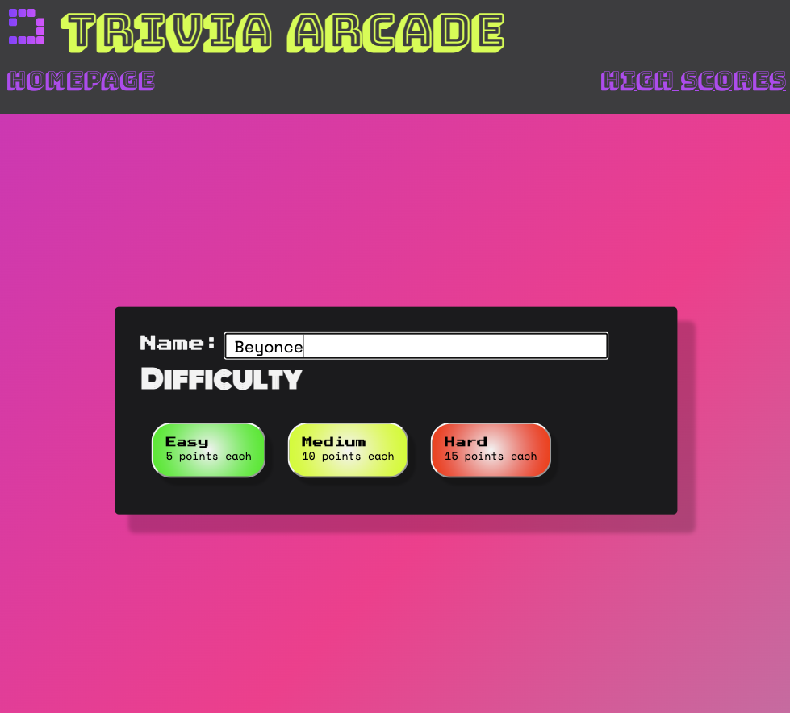
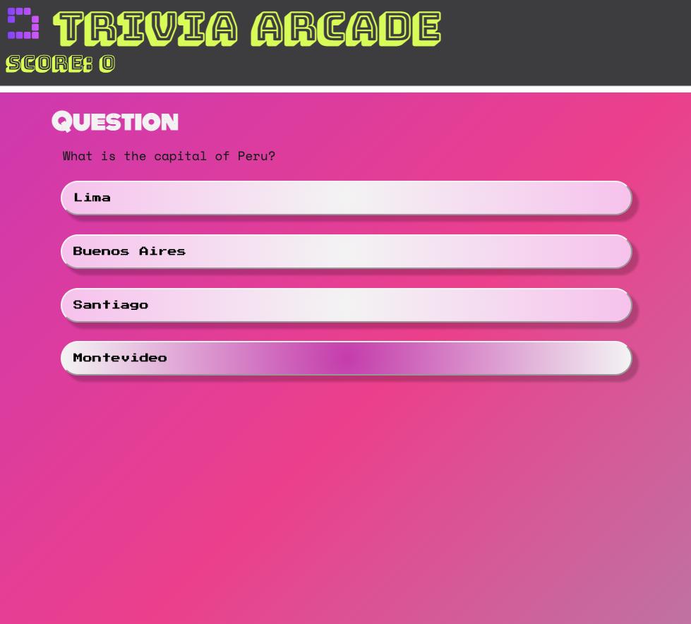
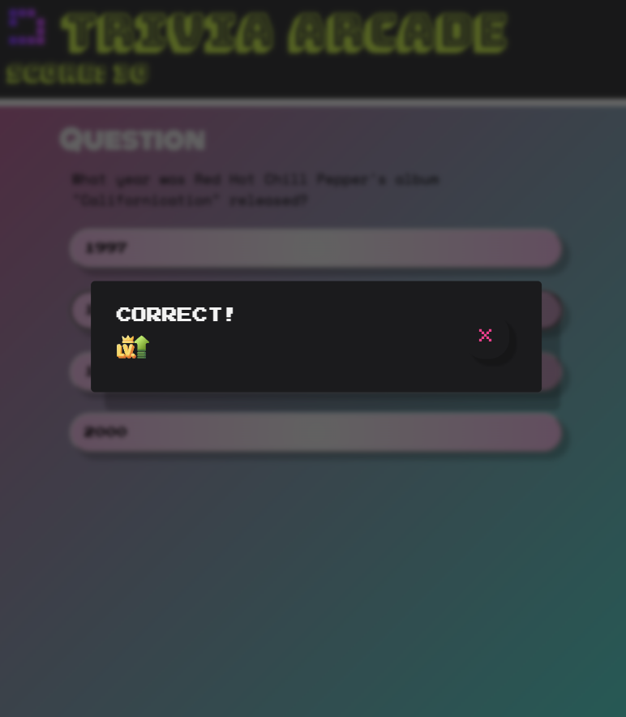
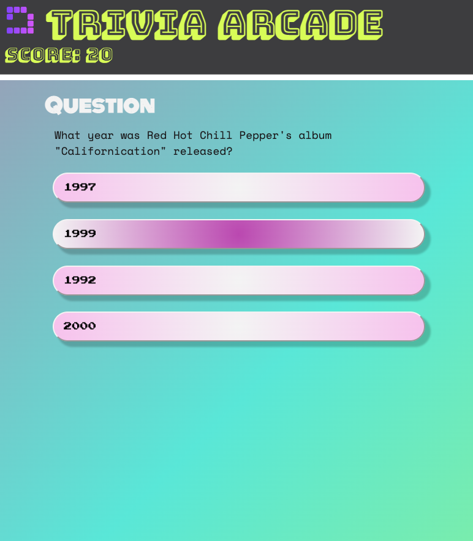
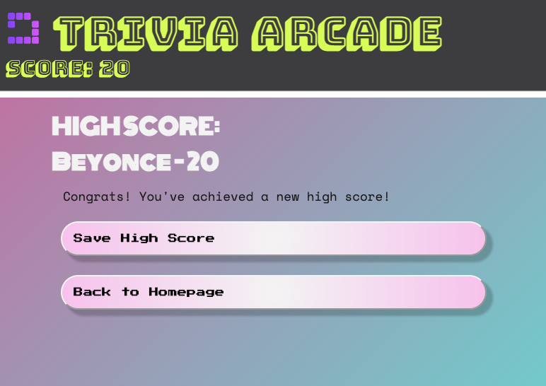
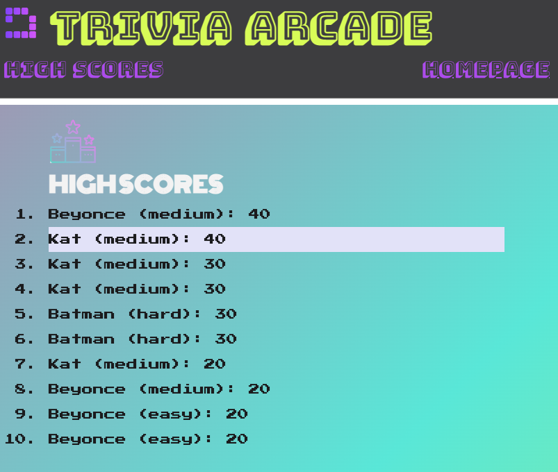

# Trivia Arcade

A trivia game!

## Authors:

Kat Gorecki
Nolan Kreiger
Frances Padilla

### User Story:

We wanted to create a fun page where people can play test their trivia based on dificulty level, with a retro vibe.

### Usage:

- Enter your name in the "Name" field and then select your difficulty level.
- Once you click the button, it will take you to the trivia quiz, which will be 10 questions long.
- If you answer correctly, points will be added to your score (5 points for easy, 10 points for medium, 15 points for hard).
- If you anwser incorrectly, you will get no points.
- A window will pop up saying you answered correctly or incorrectly. If incorrect, it will display the correct answer. Close the window and it will move on to the next question.
- After you have finished the 10 questions, you will see your name and final score.
- If you are in the top 10 highest scores, you will be able to save your name to the High Scores page and it will take you to the High Scores page.
- The High Scores will display the player name, difficulty played, and score.
- Go back to the homepage to start again!

[Live Deployment](https://slaysian.github.io/triviyaaas/)

### Screenshots:

### References:

- Open Trivia Database API (https://opentdb.com/api_config.php)
- Flat Icon (https://www.flaticon.com/)
- Manuel Pinto Codepen for gradient background (https://codepen.io/P1N2O/pen/pyBNzX)
- MDN (https://developer.mozilla.org/en-US/)
- Stack Overflow (https://stackoverflow.co/)
- UDEMY Jonas Schmedtmann courses (https://codingheroes.io/resources/)
- UDEMY Dr Angela Yu (https://appbrewery.com/)
- UDEMY Colt Steele and Stephen Grider - The Modern Javascript Bootcamp Course
- W3Schools (https://www.w3schools.com/)

### License

N/A
